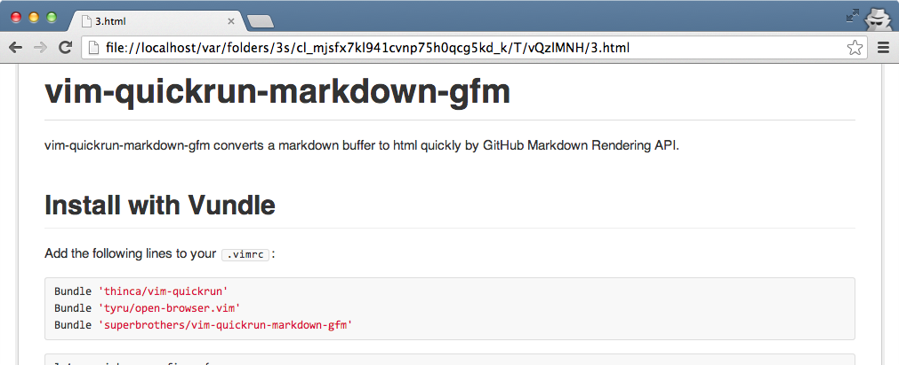

# vim-quickrun-markdown-gfm

vim-quickrun-markdown-gfm converts a markdown buffer to html quickly by GitHub Markdown Rendering API.

## Install with Vundle

Add the following lines to your `.vimrc`:

```vim
Bundle 'thinca/vim-quickrun'
Bundle 'tyru/open-browser.vim'
Bundle 'superbrothers/vim-quickrun-markdown-gfm'
```

```vim
let g:quickrun_config = {
\   'markdown': {
\     'type': 'markdown/gfm',
\     'outputter': 'browser'
\   }
\ }
```

After execute `:BundleInstall`.

If you want to use this script on GitHub Enterprise:

```vim
let g:quickrun_markdown_gfm_github_api_url = 'https://<your-github-enterprise-hostname>/api/v3'
```

## Usage

    :QuickRun markdown

For more information, see the help of vim-quickrun

    :help quickrun

## Requirements

- [curl and libcurl](http://curl.haxx.se/)
- [Markdown Rendering | GitHub API](http://developer.github.com/v3/markdown/)
- [thinca/vim-quickrun](https://github.com/thinca/vim-quickrun)
- [tyru/open-browser.vim](https://github.com/tyru/open-browser.vim)
- [revolunet/sublimetext-markdown-preview](https://github.com/revolunet/sublimetext-markdown-preview)  
    `github.css`, `highlight.css`, `highlight.js`

## License

vim-quickrun-markdown-gfm is released under the [MIT License](http://www.opensource.org/licenses/MIT).

## Screenshots


